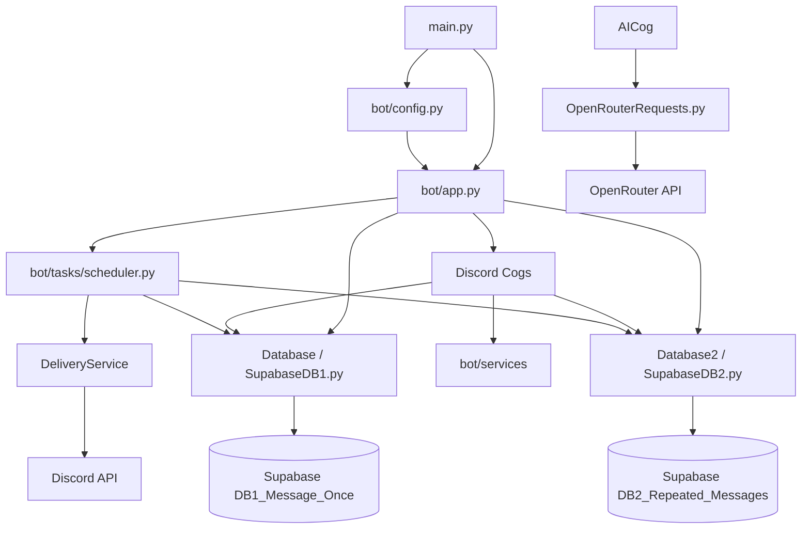

# Sir Schedule's Bot Architecture

## Overview

Sir Schedule's bot is an asynchronous Discord application built with `discord.py`. It lets users configure one-time and recurring messages, stores those settings in Supabase, delivers messages through Discord direct messages, and provides an OpenRouter-backed AI command.

The system is organized around four layers:

1. **Application layer**: constructs the bot, connects dependencies, registers commands, and starts background work.
2. **Command layer**: Discord cogs receive slash commands, validate user input, call database/service APIs, and format responses.
3. **Service layer**: contains reusable delivery and data-deletion workflows.
4. **Persistence/integration layer**: Supabase database classes, timezone helpers, and the OpenRouter client.

The top-level `main.py` is intentionally small. It loads configuration, creates the bot, and starts the Discord client.

## Directory Structure

```text
main.py
bot/
    __init__.py
    ARCHITECTURE.md
    app.py
    config.py
    state.py
    cogs/
        __init__.py
        ai.py
        messages.py
        privacy.py
        status.py
    services/
        __init__.py
        data.py
        delivery.py
    tasks/
        __init__.py
        scheduler.py
backend/
    openrouterpy/
        OpenRouterRequests.py
    supabase/
        SupabaseDB1.py
        SupabaseDB2.py
        SupabaseDB3.py
    timezones.py
```

The `__init__.py` files mark the directories as Python packages. They are currently empty because package-level initialization is not required.

## Application Startup

`main.py` is the process entrypoint:

```text
load_config()
    |
    v
create_bot(config)
    |
    v
GreeterBot(config).run(discord_token)
```

`bot/config.py` loads environment variables with `python-dotenv` and creates an immutable `Config` object containing:

- `DISCORD_TOKEN`
- `SUPABASE_URL`
- `SUPABASE_SERVICE_KEY`

Startup fails early with a `RuntimeError` if any required value is missing.

`bot/app.py` contains `GreeterBot`, the custom `commands.Bot` subclass. Its `setup_hook()` performs one-time asynchronous initialization:

1. Create the `Database`, `Database2`, and `Database3` Supabase access objects.
2. Attempt to connect all database clients.
3. Register all command cogs.
4. Synchronize slash commands with Discord.
5. Create and start the `Scheduler`.

`on_ready()` only handles the online presence and login message. This keeps one-time initialization out of a reconnect-sensitive event.

## Component Diagram



## Command Layer

Commands are grouped into Discord cogs under `bot/cogs/`.

### `OneTimeMessagesCog`

Located in `bot/cogs/messages.py`. It owns the shared message configuration workflow:

- `/schedule_message`: configures one-time, daily, or group-repeated messages, including text, time, timezone, and repeated days for DB3.
- `/view_message`
- `/add_recipient`
- `/remove_recipient`
- `/clear_recipients`

It uses the database selected by `message_type`. Timezone input is normalized and validated through `backend/timezones.py` before a timezone-aware timestamp is stored.

### `DailyMessagesCog`

Also located in `bot/cogs/messages.py`. It owns the recurring daily message workflow:

- `/view_daily_message`
- `/add_daily_recipient`
- `/remove_daily_recipient`
- `/clear_daily_recipients`

It uses `Database2` from `backend/supabase/SupabaseDB2.py`.

The message cogs share the timezone autocomplete callback, while each scheduling type uses its own database table and recipient semantics. `GroupMessagesCog` provides role-based recipient-list manipulation for DB3.

### `PrivacyCog`

Located in `bot/cogs/privacy.py`. It owns deletion workflows:

- `/clear_all_data`: deletes the invoking user's data for the current guild.
- `/begin_full_deletion`: creates a short-lived confirmation code.
- `/confirm_full_deletion`: verifies the code and deletes the user's data across guilds.

The cog delegates database operations to `DataService` rather than implementing multi-database deletion itself.

### `StatusCog`

Located in `bot/cogs/status.py`. It exposes `/database_status`, which reports the latest health state recorded for the one-time and daily-message databases.

### `AICog`

Located in `bot/cogs/ai.py`. It exposes `/say_something`. Because the OpenRouter client is synchronous, the request runs in `asyncio.to_thread()` so it does not block Discord's event loop.

## State Management

`bot/state.py` defines `AppState`, which stores process-local state shared by cogs and background tasks:

- `daily_messages_sent`: prevents a daily message from being sent more than once per guild, message, and UTC date during the current process.
- `pending_full_deletions`: stores active deletion confirmation codes and their expiration times.
- `full_deletion_lock`: protects confirmation-code updates and checks from concurrent access.
- `database_health`: stores the latest connection/query health information for database-backed features.

This state is intentionally not persistent. Supabase remains the source of truth for saved messages, recipients, and timestamps.

## Background Scheduling

`bot/tasks/scheduler.py` contains the `Scheduler` class and three `discord.ext.tasks` loops:

### One-time delivery loop

`check_scheduled_messages()` runs every 10 seconds. It:

1. Gets currently due rows from `Database`.
2. Skips empty messages.
3. Sends the message to each stored recipient through `DeliveryService`.
4. Clears the timestamp after delivery using `mark_scheduled_message_sent()`.
5. Records database health and logs failures.

### Daily delivery loop

`check_daily_scheduled_messages()` runs every 10 seconds. It:

1. Gets due rows from `Database2`.
2. Builds a cache key from guild ID, message text, and the current UTC date.
3. Skips a key that has already been processed during the current day.
4. Sends the message to each recipient.
5. Removes recipients when Discord rejects a daily DM with `discord.Forbidden`.

### Cache cleanup loop

`refresh_daily_message_cache()` runs every 60 seconds and removes cache entries from previous UTC dates.

The scheduler starts after the bot and database objects have been initialized. `stop()` is available to cancel all loops during future shutdown handling.

## Services

### `DeliveryService`

Located in `bot/services/delivery.py`. It centralizes Discord DM behavior:

- Reuses a cached Discord user when possible.
- Fetches the user when they are not cached.
- Rejects blank messages.
- Handles forbidden daily DMs by removing the recipient from the daily database.

Both one-time and daily scheduling use this service, keeping Discord delivery details out of the scheduler's database polling logic.

### `DataService`

Located in `bot/services/data.py`. It coordinates deletion across the two active databases:

- `clear_guild_data()` deletes one user's records for one guild.
- `delete_user_data()` deletes the user's records across all guilds concurrently with `asyncio.gather()`.

The service does not know about Discord response formatting or slash-command registration. It clears DB1, DB2, and DB3 data for both guild-scoped and full-user deletion workflows.

## Persistence Layer

The persistence classes remain under `backend/supabase/` and communicate with Supabase using its asynchronous client.

- `SupabaseDB1.Database` manages `DB1_Message_Once`, including one-time messages, recipients, timestamps, and sent-message cleanup.
- `SupabaseDB2.Database2` manages `DB2_Repeated_Messages`, including recurring messages, recipients, timestamps, and the `int8` `index` primary key that allows multiple messages per user and guild.
- `SupabaseDB3.Database3` manages role-based repeated messages, including its day bitmask, send count, timestamps, and role recipients.

The database classes are responsible for persistence and timestamp filtering. They do not register Discord commands or send messages.

## Data Flow Examples

### Saving a scheduled one-time message

```text
Discord interaction
    -> OneTimeMessagesCog.set_time()
    -> validate hour, minute, and timezone
    -> get_local_scheduled_datetime()
    -> Database.set_hours()
    -> Supabase DB1_Message_Once
    -> Discord confirmation
```

### Delivering a daily message

```text
Scheduler.check_daily_scheduled_messages()
    -> Database2.get_scheduled_messages()
    -> daily cache check
    -> DeliveryService.send_daily_message()
    -> Discord user DM
    -> remove recipient on discord.Forbidden
```

### Deleting all user data

```text
PrivacyCog.confirm_full_deletion()
    -> validate pending code under full_deletion_lock
    -> DataService.delete_user_data()
    -> Database.delete_user_data()
    -> Database2.delete_user_data()
    -> ephemeral Discord confirmation
```

## Error Handling and Health Reporting

Database polling errors are caught by the scheduler and recorded in `AppState.database_health`. Command-level validation errors are returned as Discord responses, generally ephemeral for private or sensitive information.

The current system logs errors with `print()` and configures a file handler in `create_bot()`, but it does not yet route all messages through the `logging` module. That is a possible future improvement.

## Design Boundaries

The intended ownership rules are:

- `main.py` starts the application only.
- `bot/app.py` composes the application and owns lifecycle setup.
- Cogs own Discord commands and interaction responses.
- Services own reusable workflows that span commands or background tasks.
- `Scheduler` owns polling intervals and process-local scheduling coordination.
- Database classes own Supabase queries.
- `backend/timezones.py` owns timezone parsing and timestamp construction.
- `OpenRouterRequests.py` owns the external AI HTTP request.

Keeping these boundaries makes it possible to change Discord command presentation, scheduling behavior, or persistence implementation independently.